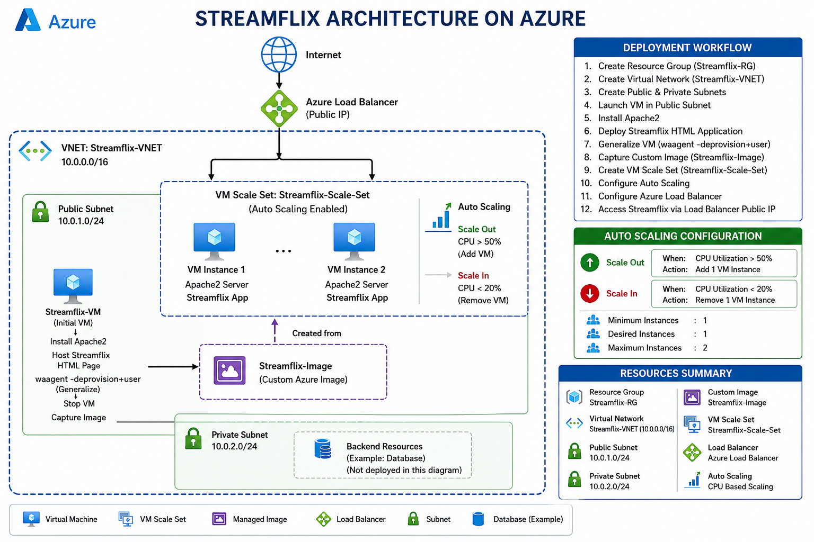

# Streamflix - Highly Available Web Application on Azure

## Project Overview

This project demonstrates the deployment of a highly available web application named Streamflix on Microsoft Azure using Virtual Machine Scale Sets (VMSS), Load Balancer, Custom Images, and Auto Scaling.

The architecture ensures high availability, scalability, and fault tolerance by automatically adding or removing VM instances based on CPU utilization.

---

## Architecture Diagram



---

## Architecture Components

### Resource Group
- Streamflix-RG

### Virtual Network
- Streamflix-VNET
- Address Space: 10.0.0.0/16

### Subnets
- Public Subnet: 10.0.1.0/24
- Private Subnet: 10.0.2.0/24

### Virtual Machine
- Ubuntu Linux VM
- Apache2 Web Server Installed
- Hosted Streamflix HTML Application

### Custom Image
Created a reusable Azure Image using:

```bash
waagent -deprovision+user
