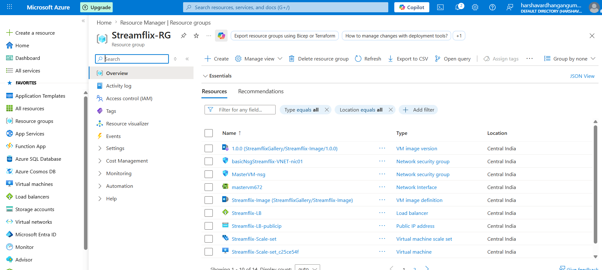
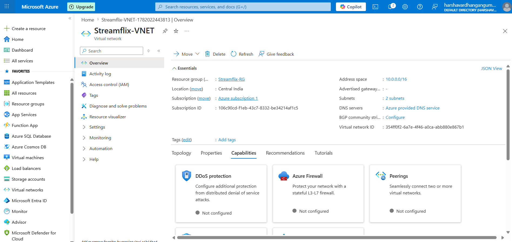
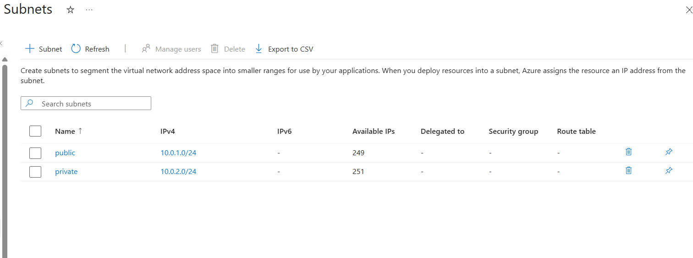
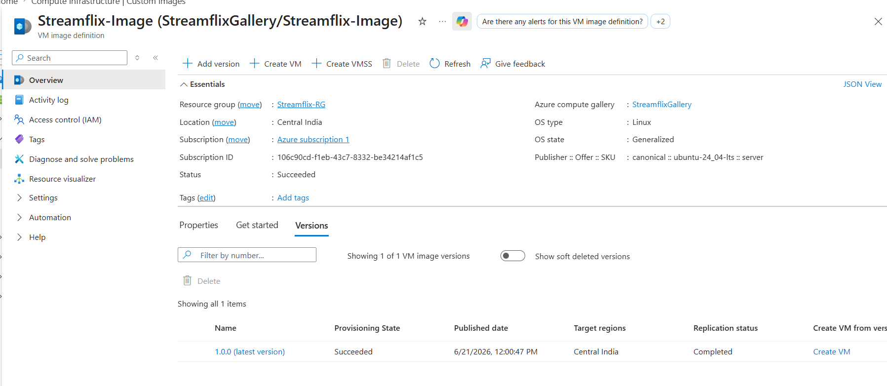
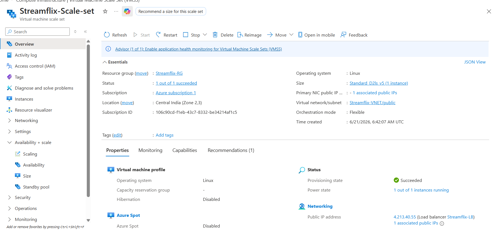
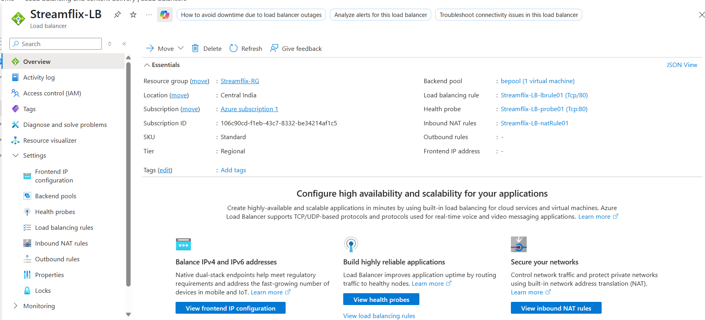
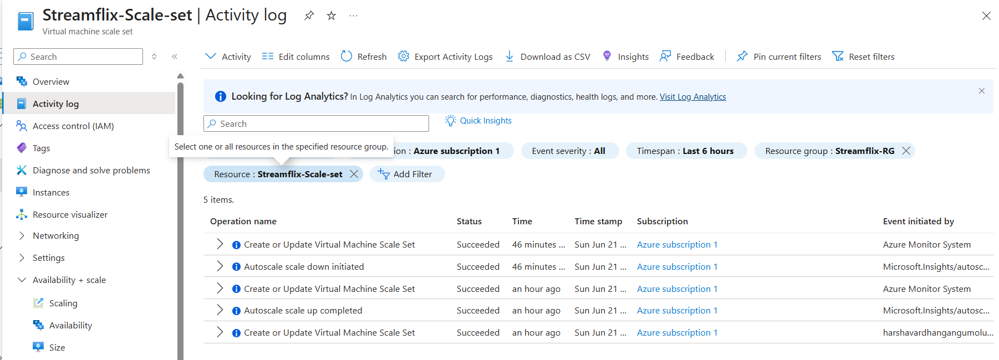

# Streamflix - Highly Available Web Application on Azure

## Project Overview

This project demonstrates the deployment of a highly available web application named Streamflix on Microsoft Azure using Virtual Machine Scale Sets (VMSS), Load Balancer, Custom Images, and Auto Scaling.

The architecture ensures high availability, scalability, and fault tolerance by automatically adding or removing VM instances based on CPU utilization.

---

## Project Outcome

Successfully deployed a highly available Streamflix web application on Azure using:

- Azure Virtual Network
- Public and Private Subnets
- Apache Web Server
- Custom VM Image
- Azure VM Scale Set
- Azure Load Balancer
- CPU-Based Auto Scaling

The architecture automatically scales out when CPU utilization exceeds 50% and scales in when CPU utilization drops below 20%, ensuring efficient resource utilization and high availability.

## Architecture Diagram


---
## Deployment Guide

For detailed deployment instructions, refer to:

- [Deployment Steps](docs/deployment-steps.md)

## Architecture Components

### Resource Group
- Streamflix-RG

### Virtual Network
- Streamflix-VNET
- Address Space: 10.0.0.0/16

### Subnets
- Public Subnet: 10.0.1.0/24
- Private Subnet: 10.0.2.0/24

### Virtual Machine
- Ubuntu Linux VM
- Apache2 Web Server Installed
- Hosted Streamflix HTML Application

### Custom Image
Created a reusable Azure Image using:

## Implementation Screenshots

### Resource Group


### Virtual Network


### Subnet Configuration


### Custom VM Image


### VM Scale Set


### Azure Load Balancer


### Deployment Activity


```bash
waagent -deprovision+user
